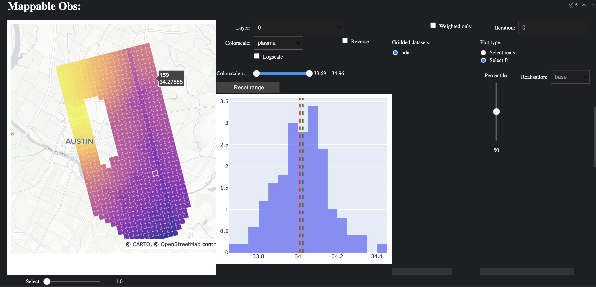

# pypestvis
Work in progress library to help quickly setup interactive visulisation of PEST/PEST++ results.

Uses metadata on PEST observation data to georeference observations and plot them, where appropriate.

Builds plot laysout and callbacks to support interaction with stochastic results.

Currently leans on flopy for georeferencing on the fly and only setup for stuct grids where k,i,j columns are in the PEST obs data metadata (i.e. in hd obsnme).

## Example
```python
import pypestvis as ppv
import pyemu
```
Read in a PEST control file and add k,i,j columns to the observation data dataframe
```python
pst = pyemu.Pst(str(m_d / "freyberg.pst"))
obs = pst.observation_data
obs.loc[obs.oname=='hds', ['k', 'i', 'j']] = obs.loc[obs.oname=='hds'].obgnme.str.rsplit("_",expand=True, n=3)[[1,2,3]].values
pst.observation_data = obs
```
Build handler
```python
vh = ppv.VisHandler(pst, wd=m_d, crs="epsg:32614")
```
Build layout (in jupyter)
```python
display(vh.default_map_layout)
```


Check out [notebook](examples/freyberg.ipynb) for a full example.
